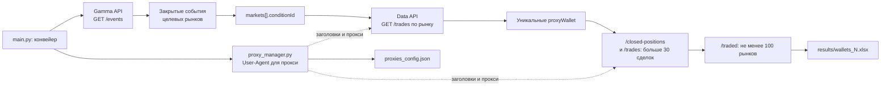

# BotsFinder

Скрипт собирает активность на краткосрочных рынках Polymarket, отбирает кошельки по активности и числу рынков и сохраняет результат в Excel.

## Overview

`main.py` запускает последовательный конвейер:

1. Загружает закрытые события Polymarket по четырём 15-минутным рынкам BTC, SOL, ETH и XRP и оставляет события, в slug которых встречается целевой идентификатор.
2. Получает сделки для рынков этих событий и собирает уникальные адреса из поля `proxyWallet`.
3. Оставляет кошельки, у которых хотя бы по одной закрытой позиции найдено больше 30 сделок.
4. Оставляет среди них кошельки, торговавшие как минимум на 100 рынках.
5. Записывает адреса, число рынков и ссылки на Polymarket и Hashdive в файл `results/wallets_N.xlsx`.

Это эвристический сборщик и фильтр кошельков. Код не подтверждает, что найденный кошелёк принадлежит боту.

## Features

- Асинхронные HTTP-запросы через `aiohttp`.
- Постраничный сбор событий и сделок Polymarket.
- Уникализация кошельков по `proxyWallet`.
- Проверка активности по закрытым позициям и числу сделок.
- Экспорт в XLSX с кликабельными ссылками.
- Сохранение привязок User-Agent к прокси в `proxies_config.json`.

## Tech Stack

| Область | Технологии |
| --- | --- |
| Язык | Python 3.14 или новее |
| HTTP | `aiohttp` |
| User-Agent | `fake-useragent` |
| XLSX | `openpyxl` |
| Управление зависимостями | `uv`, `uv.lock` |
| Источники данных | Polymarket Gamma API и Data API |

`requests` также указан среди зависимостей `pyproject.toml`, но в коде приложения сейчас не используется.

## Architecture



Запрос событий к Gamma API выполняется напрямую. Запросы к Data API используют список прокси из `src/utils/constants.py`; если список пуст, код обращается напрямую. Для сетевых запросов приложение использует одну общую `aiohttp.ClientSession`.

## Project Structure

```text
.
├── main.py                    # Точка входа и последовательность этапов
├── pyproject.toml             # Метаданные и прямые зависимости
├── uv.lock                    # Зафиксированные версии зависимостей
├── .python-version            # Версия Python для uv: 3.14
└── src/
    ├── core/
    │   ├── scan_events.py     # Поиск целевых событий через Gamma API
    │   ├── scan_trades.py     # Сбор сделок и уникальных кошельков
    │   └── scan_wallets.py    # Фильтры активности и числа рынков
    └── utils/
        ├── constants.py      # API URL, целевые slug и список прокси
        ├── proxy_manager.py  # Заголовки и привязка User-Agent к прокси
        └── exporter.py       # Экспорт в Excel
```

## Requirements / Prerequisites

- Python **3.14+** (`pyproject.toml` требует `>=3.14`, `.python-version` указывает `3.14`).
- [uv](https://docs.astral.sh/uv/) для создания окружения и установки зависимостей.
- Доступ в интернет к Polymarket Gamma API и Data API.
- Если используется заданный список прокси — доступные HTTP-прокси. Прокси применяются к запросам Data API; запрос событий к Gamma API идёт напрямую.

Локальная база данных, Docker и отдельные внешние хранилища проекту не нужны.

## Installation

В корне репозитория установите Python и синхронизируйте зависимости по lock-файлу:

```bash
uv python install 3.14
uv sync --locked
```

## Configuration

Приложение не читает `.env`, переменные окружения или аргументы командной строки. Настройки задаются в исходниках.

| Параметр | Где задан | Текущее значение / назначение |
| --- | --- | --- |
| `GAMMA_API_URL`, `DATA_API_URL` | `src/utils/constants.py` | Адреса Gamma API и Data API Polymarket |
| `TARGET_SLUGS` | `src/utils/constants.py` | `btc-updown-15m`, `sol-updown-15m`, `eth-updown-15m`, `xrp-updown-15m` |
| `PROXIES` | `src/utils/constants.py` | Список прокси; пустой список включает прямые запросы к Data API |
| `REQUIRED_COUNT` | `src/core/scan_events.py` | Цель — 800 событий |
| `min_count` | `main.py` | Минимум 100 рынков в фильтре `/traded` |
| Порог активности | `src/core/scan_wallets.py` | Больше 30 сделок в одном из проверяемых рынков |
| `CONFIG_FILE` | `src/utils/proxy_manager.py` | `proxies_config.json` в текущей рабочей директории; хранит соответствие прокси и User-Agent |
| `OUTPUT_FOLDER` | `src/utils/exporter.py` | `results` в текущей рабочей директории |

Прокси и остальные параметры меняются непосредственно в указанных файлах. Не добавляйте реальные учётные данные прокси в документацию или публичные примеры. При пустом `PROXIES` запросы идут без прокси; список User-Agent для прокси не создаётся.

## Running the Project

Запустите из корня репозитория:

```bash
uv run main.py
```

Скрипт последовательно выполняет сбор и фильтрацию. Если этап не находит подходящие данные, он выводит сообщение и завершает работу без XLSX-файла. При успешной выгрузке файл появляется в `results/`; нумерация начинается с `wallets_1.xlsx` и увеличивается, чтобы не перезаписать предыдущий файл.

## API

Проект не поднимает собственный HTTP-сервер. Он отправляет запросы к внешним API Polymarket:

| API | Используемые маршруты | Назначение |
| --- | --- | --- |
| Gamma API (`https://gamma-api.polymarket.com`) | `GET /events` | Чтение закрытых событий порциями по 500; код отбирает события по slug и возвращает до 800 совпадений |
| Data API (`https://data-api.polymarket.com`) | `GET /trades` | Чтение сделок по рынку; затем проверка сделок кошелька в рынках его закрытых позиций |
| Data API | `GET /closed-positions` | Получение до 50 закрытых позиций кошелька для проверки активности |
| Data API | `GET /traded` | Получение числа рынков, на которых торговал кошелёк |
